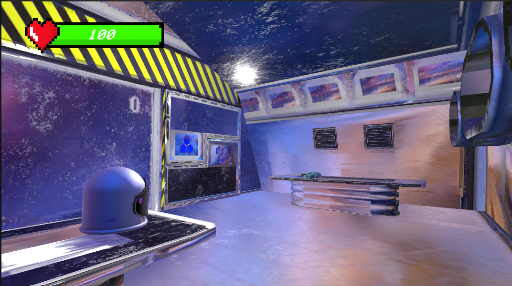
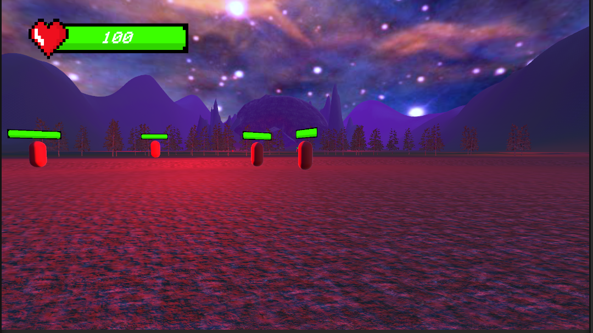
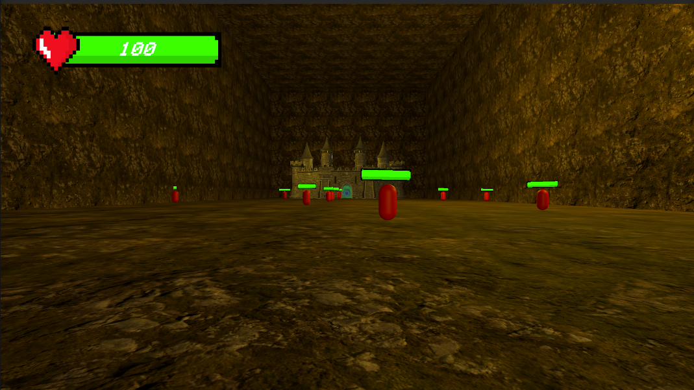
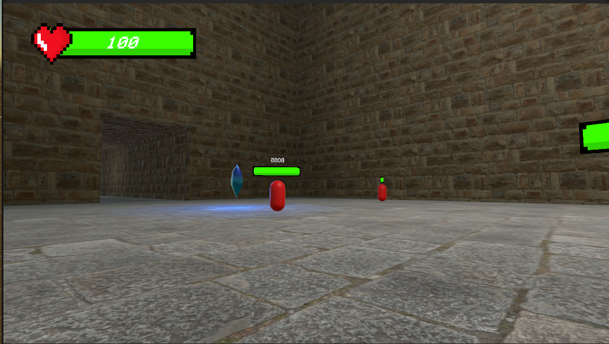

# The New World

Welcome to **The New World**, an immersive PC game set in space where you embark on an epic adventure as a stranded astronaut. Your mission is to explore an unknown planet, find and restore the missing core reactor to repair your crashed spaceship, and make your way back home. Prepare to face challenging encounters with aliens and overcome various obstacles as you progress through four captivating levels: the crashed spaceship, the forest, the cave, and the underground castle.

## Features

- **Captivating Storyline**: Experience a gripping narrative as you unravel the mysteries of the unknown planet and strive to return home.
- **Immersive Gameplay**: Dive into a rich and immersive space environment, complete with stunning visuals and atmospheric sound effects.
- **Exploration**: Traverse diverse landscapes, from the wreckage of your spaceship to ancient underground structures, as you search for clues and resources.
- **Encounters and Challenges**: Encounter intriguing alien species and overcome obstacles that stand in your way.

## Screenshots

_Exploring the wreckage of the crashed spaceship._

_Venturing deep into the mysterious forest._

_Navigating treacherous caves._

_Confronting the final challenge in the underground castle._

## Controls

- **Movement**: W, A, S, D
- **Jump**: Spacebar
- **Interact**: Left mouse button
- **Attack**: Left Mouse Button

## Desired Settings

- Audio Volume: Adjust the volume levels for sound effects and music to your preference.

## Limitations and Known Bugs

- In rare cases, certain audio effects may not play correctly. Restarting the game usually resolves this issue.
- While we have taken great care to ensure a smooth gameplay experience, there may be minor collision detection issues or visual glitches in specific areas. We appreciate your understanding and encourage you to report any bugs you encounter.

## How to Win the Game

To win the game and successfully return home, you must:

1. Explore the crashed spaceship to gather resources and discover clues.
2. Navigate through the forest, cave, and underground castle levels, overcoming obstacles and defeating aliens along the way.
3. Find the missing core reactor required to repair your spaceship.
4. Return to the crashed spaceship and install the core reactor to fix it.
5. Leave the planet.

## Credits

### Enemy codes:
- [From Dave/GameDevelopment on YouTube](https://youtu.be/UjkSFoLxesw)
### Audio Mixers/Sliders:
- [KapKoder on YouTube](https://youtu.be/pbuJUaO-wpY)
### Health bar codes and fade transition: 
- Brackeys on YouTube
 - [Health Bar](https://www.youtube.com/watch?v=BLfNP4Sc_iA)
 - [Transition](https://youtu.be/CE9VOZivb3I)
### Portal particle system:
- [Aqsa Nadeem on YouTube](https://youtu.be/_qj-chjOBXc)
### Portal image:
- [Maximillin ludex on Flickr](https://www.flickr.com/photos/fightforthelight/7043965847)

### Models (from Unity Asset Store):
- [Game Stuff Studios (Sci-Fi Pistol #1)](https://assetstore.unity.com/packages/3d/props/guns/sci-fi-pistol-1-141442)
- [forst (Conifers BOTD)](https://assetstore.unity.com/packages/3d/vegetation/trees/conifers-botd-142076)
- [Plutark_games (Medieval_Castle)](https://assetstore.unity.com/packages/3d/environments/medieval-castle-227378)
- [ZAKMAN (Rock_Pack)](https://assetstore.unity.com/packages/3d/environments/landscapes/rock-pack-210536)

### Audio (from Unity Asset Store)::
- [JDSherbert(Ambiences Music Pack (BGM))](https://assetstore.unity.com/packages/audio/music/ambiences-music-pack-bgm-247515)
- [Matthew Anett (Classic Footstep SFX)](https://assetstore.unity.com/packages/audio/sound-fx/classic-footstep-sfx-173668)
- [GWriterStudio (Space Ambient Album – 101218)](https://assetstore.unity.com/packages/audio/ambient/space-ambient-album-101218-130708)

### Textures:
- [A dog’s life software (Outdoor Ground Textures)](https://assetstore.unity.com/packages/2d/textures-materials/floors/outdoor-ground-textures-12555)
- [Cave, castle textures (PolyHaven)](https://polyhaven.com/textures)

